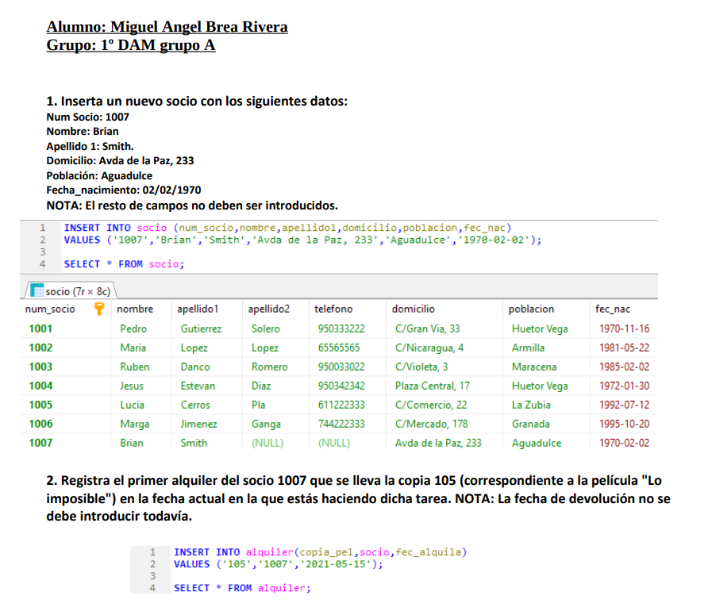

## 🧩 Ejercicio de Bases de Datos — Consultas SQL

---

[↩️ Volver al inicio](../../README.md)

---

---

---

## 🔍 Descripción del trabajo

- Este conjunto de ejercicios forma parte de las prácticas de Bases de Datos del primer curso.

- El objetivo fue aplicar operaciones SQL avanzadas sobre un sistema de gestión de videoclub, practicando inserciones, actualizaciones, eliminaciones y transacciones.

> A través de estos problemas se trabajaron las siguientes competencias:

- Manejo completo de sentencias DML (INSERT, UPDATE, DELETE) y de control de transacciones (COMMIT, ROLLBACK).

- Comprensión de la importancia de la integridad y consistencia de datos al usar transacciones.

- Aplicación de subconsultas y agregaciones para determinar valores medios o condiciones complejas.

- Diseño de consultas en una sola sentencia, optimizando la eficiencia y claridad del código SQL.

- Reflexión sobre la gestión de operaciones atómicas y su relación con la fiabilidad del sistema.

---

Este ejercicio me permitió afianzar los fundamentos de SQL y transacciones, entendiendo cómo las acciones en una base de datos deben ejecutarse como una unidad lógica para mantener la coherencia de la información.

---

- 💡 Resultado

> En el documento de soluciones (docs/soluciones.pdf) se muestran las sentencias SQL utilizadas, acompañadas de comentarios y capturas de los resultados obtenidos en MySQL.

> Además, se incluye una reflexión final sobre el uso de transacciones, explicando cómo se aplican en contextos reales de facturación y préstamos en bases de datos relacionales.
