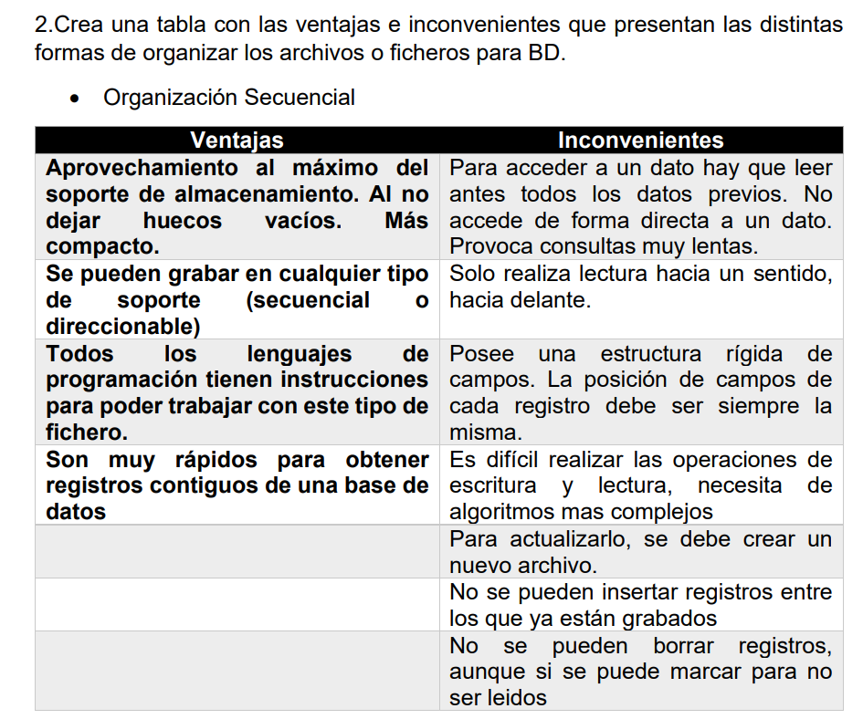

# Tarea de Bases de Datos: Almacenamiento de la información

[↩️ Volver al inicio](../../README.md)

---

> Este repositorio contiene los recursos y apuntes que he generado mientras realizaba la tarea sobre sistemas de gestión de bases de datos, organización de archivos y fragmentación de información. La práctica me permitió comprender los conceptos fundamentales del manejo de datos y cómo se gestionan dentro de un sistema informático.

---

---

> Tarea donde realice una presentación sobre el Almacenamiento de la información

📊 [Ver presentación PowerPoint](docs/tarea_almacenamiento_informacion.pptx)

---

## Conceptos Aprendidos

### 1. Desarrollo de aplicaciones sin bases de datos

- Es posible crear una aplicación de control de ventas usando **arrays, listas o ficheros**.
- Los **sistemas operativos** ofrecen recursos como ficheros, carpetas y directorios para guardar información.
- Problemas al crecer los datos: eficiencia y mantenimiento, lo que justifica el uso de **bases de datos**.

**Tipos de ficheros:**

- Permanentes: maestros, constantes o históricos.
- Temporales: intermedios, de maniobras o de resultados.

---

### 2. Organización de archivos

**Organización secuencial**

- Ventajas: lectura rápida de registros contiguos.
- Inconvenientes: consultas lentas, difícil inserción/eliminación.

**Organización secuencial encadenada**

- Ventajas: mantiene orden y permite reorganización parcial.
- Inconvenientes: requiere recalcular punteros al añadir o borrar registros.

**Organización secuencial indexada**

- Ventajas: búsqueda rápida de datos.
- Inconvenientes: reorganización costosa al añadir registros.

**Organización directa o aleatoria**

- Ventajas: acceso muy rápido, fácil modificación.
- Inconvenientes: consultas sobre muchos registros más lentas, borrado indirecto.

---

### 3. Ventajas de las bases de datos frente a ficheros

- Independencia de datos y programas.
- Integridad y seguridad.
- Menor redundancia y mejor documentación.
- Acceso más eficiente y concurrente.
- Menor espacio de almacenamiento.

---

### 4. Tipos de bases de datos

- **Relacionales:** las más utilizadas actualmente.
- **Jerárquicas y de red:** en desuso.
- **NoSQL:** cada vez más populares, especialmente para grandes volúmenes de datos.  
  Tipos de NoSQL:
  - Clave-valor (ej.: Cassandra, BigTable, HBase)
  - Documentales (ej.: MongoDB, CouchDB)
  - Grafos (ej.: Neo4j)
  - Orientadas a objetos (ej.: Db4o, Gemstone)

**Aplicaciones de NoSQL:** telecomunicaciones, streaming (Netflix), redes sociales (Facebook), investigación científica (CERN).

---

### 5. Modelos de bases de datos

- **Conceptual:** describe entidades, relaciones y restricciones. Único por base de datos.
- **Externos:** adaptados a cada grupo de usuarios; muestran solo la información relevante.
- Diferencia: los externos son cercanos al usuario, los conceptuales son generales.

---

### 6. Funcionamiento de un SGBD

Pasos cuando un usuario solicita datos:

1. Usuario realiza solicitud.
2. SGBD traduce la instrucción al esquema lógico y comprueba permisos.
3. Acceso al esquema físico.
4. El sistema operativo obtiene los datos.
5. Los datos pasan al buffer y luego al usuario.
6. En caso de errores, el SGBD devuelve indicadores.

**Niveles de abstracción:**

- Físico: cómo se almacenan los datos.
- Conceptual: organización de datos y relaciones.
- Externo: visión de los datos para cada grupo de usuarios.

**Funciones del SGBD:**

- Definición (DDL): crear estructuras y relaciones.
- Manipulación (DML/DQL): añadir, eliminar, modificar y consultar datos.
- Control (DCL): seguridad, copias de seguridad, gestión de usuarios.

---

### 7. Tipos de almacenamiento

- **Disco SATA:** económico, fácil de instalar; velocidad menor.
- **Disco SCSI:** alta velocidad y confiabilidad; no eficiente en grandes volúmenes.
- **RAID:** mejor capacidad y seguridad; recuperación no garantizada.
- **NAS:** almacenamiento compartido en red; requiere buena inversión y conexión.
- **SAN:** multi-servidor, tolerancia a fallos; costoso y complejo.

---

### 8. Fragmentación de datos

- **Horizontal:** separa registros según valores de una columna (ej.: escuela).
- **Vertical:** separa columnas según criterios (ej.: notas y nombre/escuela).

---

## Recursos Utilizados

- [Temario que estudie](recursos/almacenamiento_informacion.pdf): teoría sobre almacenamiento de información, bases de datos relacionales y NoSQL.
- [Apuntes adicionales](recursos/bbdd-nosql.pdf): apuntes extras sobre bases de datos no-sql.

---

Este repositorio refleja el aprendizaje sobre **bases de datos, organización de archivos, tipos de almacenamiento, SGBD, fragmentación de información y bases de datos NoSQL**, integrando teoría y práctica.
