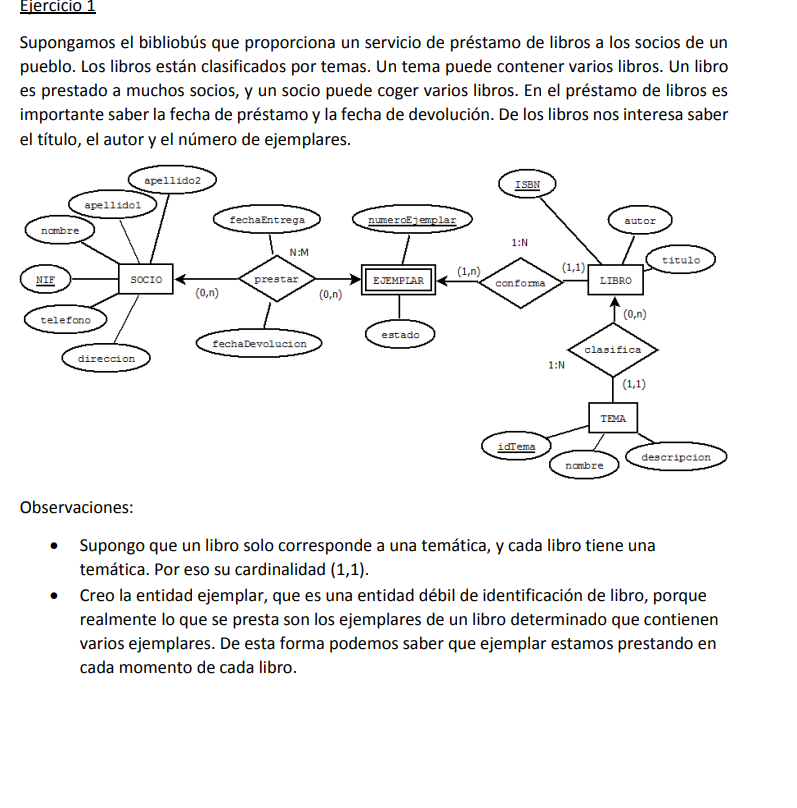

# Modelado de bases de datos, diseño E/R y normalización.

[↩️ Volver al inicio](../../README.md)

---

> Este repositorio contiene las resoluciones de ejercicios prácticos de modelado de bases de datos, diseño E/R y normalización hasta 3FN. A través de estas tareas he adquirido habilidades fundamentales para la gestión y organización de la información en sistemas de bases de datos.

---

---

> Realice tareas extras de normalización para afianzar conceptos.

---

## 📝 Lo que he aprendido realizando estas tareas:

- Diseño de modelos E/R

- Comprender la relación entre entidades, atributos y claves primarias.

- Determinar las cardinalidades correctas según las reglas de negocio.

- Representar correctamente relaciones simples, ternarias y de especialización.

- Identificar y modelar entidades débiles de existencia para reflejar dependencias (por ejemplo, ejemplares de libros o proyectos asociados a clientes).

- Transformación de modelos E/R a modelos relacionales

- Convertir diagramas E/R en tablas normalizadas.

- Establecer claves primarias y foráneas correctamente.

- Traducir las relaciones de especialización y generalización a estructuras relacionales adecuadas.

- Diseñar correctamente las relaciones ternarias y atributos de relación (como fechas de préstamo o venta).

- Normalización de datos

- Analizar tablas y detectar dependencias funcionales.

- Aplicar las formas normales 1FN, 2FN y 3FN para garantizar consistencia y evitar redundancia.

- Identificar atributos que deben separarse en nuevas tablas para cumplir las reglas de integridad.

- Comprensión de reglas de negocio y restricciones

- Aplicar restricciones como NOT NULL, UNIQUE, CHECK y relaciones de integridad referencial.

- Modelar situaciones del mundo real, como préstamos de libros, ventas de productos o operaciones bancarias.

- Decidir cardinalidades mínimas y máximas en función de escenarios posibles (por ejemplo, un gerente sin departamentos asignados).

- Pensamiento crítico en diseño de bases de datos

- Evaluar escenarios complejos (como ventas de múltiples artículos, reservas de viajes o proyectos universitarios) y diseñar esquemas que reflejen fielmente la realidad.

- Identificar excepciones y casos límite (por ejemplo, libros sin autor registrado o clientes sin proyectos activos).

---

### 📂 Estructura de ejercicios

Bibliobus/ → Ejercicios de préstamo de libros y modelado de relaciones entre libros, ejemplares y socios.

Transporte/ → Ejercicios sobre relaciones ternarias entre autobuses, conductores y destinos.

Distribucion/ → Ejercicios de proveedores, artículos, vendedores y ventas.

Educacion/ → Modelado de centros educativos, profesores y asignaturas.

Automoviles/ → Ejercicios sobre coches nuevos y usados, clientes y mecánicos.

AgenciaViajes/ → Ejercicios de gestión de oficinas, viajes y viajeros.

Banca/ → Ejercicios de sucursales, clientes, cuentas y movimientos.

Normalizacion/ → Ejercicios de normalización hasta 3FN para diferentes casos prácticos.

---

### 📚 Recursos

- Durante la realización de estas tareas, he utilizado los siguientes recursos:

- Temario de estudio: Material sobre normalización y modelado E/R, que me ayudó a comprender cómo estructurar correctamente las bases de datos y aplicar las reglas de integridad.

- Programa de diseño: Dia, utilizado para crear los diagramas E/R y el modelo relacional, lo que permitió visualizar claramente las relaciones entre entidades, atributos y restricciones antes de implementarlas en SQL.

> Estos recursos fueron esenciales para entender el proceso completo, desde el análisis conceptual hasta la implementación práctica en SQL, fortaleciendo mis conocimientos en diseño y gestión de bases de datos.

---

### 💡 Reflexión final

> Realizando estos ejercicios he aprendido que el modelado de bases de datos no es solo una tarea técnica, sino un proceso de análisis del mundo real, donde cada entidad, relación y restricción debe reflejar fielmente la información que queremos gestionar.

> He desarrollado la capacidad de analizar, organizar y estructurar datos complejos, anticipando posibles problemas de redundancia o inconsistencias, y aplicando buenas prácticas de diseño que garantizan la integridad y eficiencia de la base de datos.
