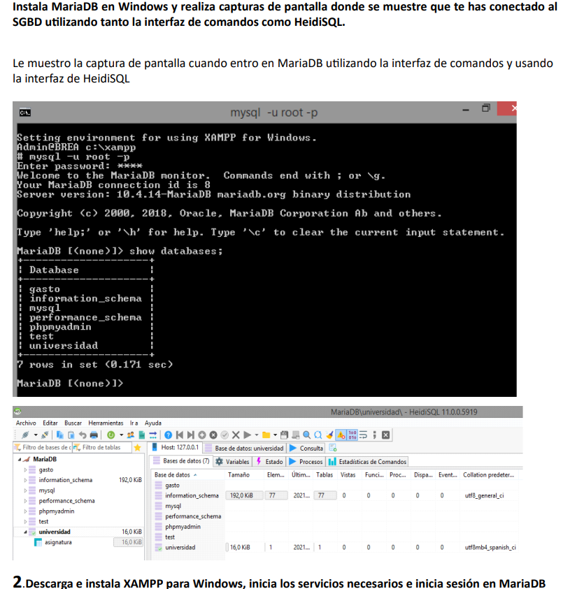

# Prácticas Laboratorio MariaDB – 1º DAM

[↩️ Volver al inicio](../../README.md)

---

> Estas tareas recogen **mi aprendizaje práctico sobre bases de datos** a través de ejercicios con MariaDB y la gestión de usuarios y permisos. El objetivo principal ha sido aplicar conceptos teóricos de SQL, modelado relacional y administración de SGBD en un entorno real.

---

---

## 📂 Contenido de la carpeta

- **Instalación y conexión a MariaDB**
  - Capturas de pantalla mostrando el acceso a MariaDB mediante:
    - Interfaz de comandos
    - HeidiSQL
    - phpMyAdmin con XAMPP
  - Aprendizaje: configurar un SGBD y utilizar varias herramientas para conectarse y gestionar la base de datos.

- **Creación de base de datos y tablas**
  - Creación de la base de datos `UNIVERSIDAD`.
  - Tablas: `PROFESOR`, `MODULO/ASIGNATURA`, `ALUMNO`, `MATRICULA`.
  - Aplicación de **restricciones de integridad**:
    - Claves primarias y foráneas
    - Campos únicos y no nulos
    - Restricciones `CHECK` para validar valores
  - Aprendizaje: diseñar tablas siguiendo buenas prácticas de normalización y asegurando consistencia de los datos.

- **Modificación de tablas**
  - Uso de `ALTER TABLE` para:
    - Añadir y eliminar columnas
    - Renombrar tablas
    - Crear índices
    - Aplicar o desactivar restricciones
  - Aprendizaje: manejar estructuras de datos existentes de forma flexible y segura.

- **Gestión de usuarios y permisos (DCL)**
  - Creación de usuarios (`CENTRO`, `PEPE`, `JUAN`) y roles (`usuariosHotel`).
  - Asignación y revocación de permisos:
    - `SELECT`, `INSERT`, `CREATE` y `ALL PRIVILEGES`
  - Comprobación de accesos mediante distintos usuarios.
  - Aprendizaje: controlar el acceso a datos de forma granular y entender la importancia de roles y privilegios.

- **Prácticas de consultas y transacciones**
  - Ejecución de **consultas SQL complejas** sobre tablas de ejemplo.
  - Comprensión de la necesidad de **transacciones** para mantener la consistencia de la base de datos.
  - Aprendizaje: unir teoría y práctica, aplicando condiciones, agregaciones y relaciones entre tablas.

---

## 🌱 Lo que he aprendido

Al completar estas tareas, he consolidado competencias clave de bases de datos:

- Configuración y conexión a un SGBD (MariaDB) desde varias herramientas.
- Diseño de bases de datos relacionales y normalización de tablas.
- Implementación de **restricciones y reglas de integridad** para mantener datos consistentes.
- Modificación y adaptación de estructuras de tablas mediante `ALTER TABLE`.
- Creación y gestión de **usuarios, roles y permisos** para un acceso seguro.
- Ejecución de **consultas SQL complejas** y comprensión de transacciones.
- Documentación profesional de prácticas para mostrar progreso y aprendizaje.

---