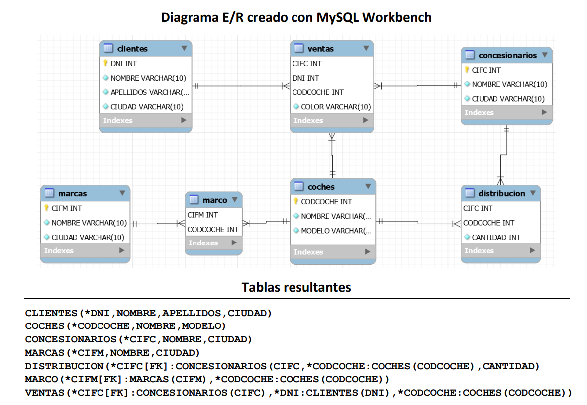
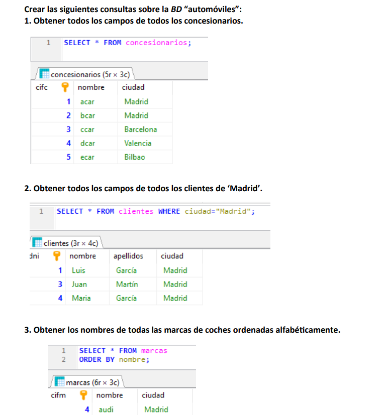

## Tareas usando Sentencias SQL para una BBDD sobre Automoviles

[↩️ Volver al inicio](../../README.md)

---

---

---

### 🌱 Aprendizajes al resolver estos ejercicios

- Al trabajar en estos 44 ejercicios sobre la base de datos “automóviles”, he podido consolidar y ampliar mis conocimientos en SQL y gestión de bases de datos, incluyendo:

> Consultas básicas y avanzadas:

- Selección de todos los campos y filtros con WHERE.

- Ordenación de resultados con ORDER BY.

- Uso de operadores lógicos (AND, OR, NOT) y comparaciones.

> Agregaciones y funciones de grupo:

- Cálculo de medias, totales y conteos con AVG(), COUNT(), SUM().

- Uso de GROUP BY y condiciones con HAVING.

> Subconsultas y consultas correlacionadas:

- Comparaciones entre registros de distintas tablas.

- Filtrado con subconsultas para condiciones complejas.

- Uso de EXISTS y NOT EXISTS para validar relaciones entre tablas.

> Práctica con relaciones y claves:

- Combinación de datos de varias tablas mediante JOINs.

- Comprensión de las relaciones entre clientes, concesionarios y coches.

- Aplicación de restricciones de integridad y consistencia de datos.

> Operadores especiales y condiciones avanzadas:

- Rangos (BETWEEN), patrones (LIKE) y negaciones.

- Comparaciones de máximos y mínimos de valores.

- Filtrado condicional según atributos de otras tablas.

---

> Resolución de problemas reales:

- Aprender a analizar el enunciado y el esquema de la base de datos.

- Planificar la consulta correcta antes de escribir el código.

- Interpretar correctamente los resultados y detectar cuando no existen registros que cumplan la condición.

---

> 💡 Gracias a estos ejercicios, he mejorado mi capacidad de razonamiento lógico, modelado de consultas y manejo de datos en entornos relacionales, lo que me permite abordar problemas de bases de datos más complejos y desarrollar proyectos más completos en SQL.
