# Álbum de Cartas Educativo

[↩️ Volver al inicio](../../README.md)

---

- Este proyecto representa una forma práctica de aplicar todo lo que he aprendido durante el primer curso de Desarrollo de Aplicaciones Multiplataforma (DAM), especialmente en la asignatura de Lenguajes de Marcas.

- Durante el curso he estudiado tecnologías como HTML, CSS, JavaScript, JSON y Bootstrap, y este proyecto me ha servido para poner en práctica todo ese conocimiento de manera creativa y funcional.

- He querido ir más allá de los ejercicios del aula y crear algo que realmente me motive, donde pueda integrar conceptos de desarrollo web, diseño y lógica de programación.

---

## Resumen del proyecto

- Álbum de Cartas Educativo es una aplicación web (HTML/CSS/JavaScript) para repasar contenidos mediante cartas coleccionables y minijuegos.
- El usuario puede abrir sobres, coleccionar cartas en un álbum, jugar a un trivial, y ganar sobres extra mediante una ruleta. El objetivo final es convertir esto en una plataforma de repaso/estudio gamificada donde yo (o cualquier usuario) pueda crear álbumes basados en su propio material.

> Características principales implementadas (versión actual):

- Interfaz responsive construída con HTML5 y CSS3 (diseño propio inspirándome en conceptos de Bootstrap).

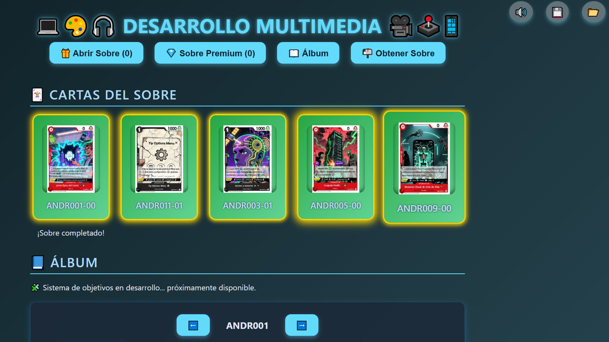

> Lógica en JavaScript (vanilla):

- Apertura de sobres (normales y premium) en mi juego educativo.

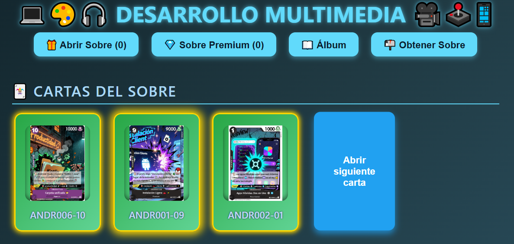

- Añadir cartas al álbum y marcar como nuevas.

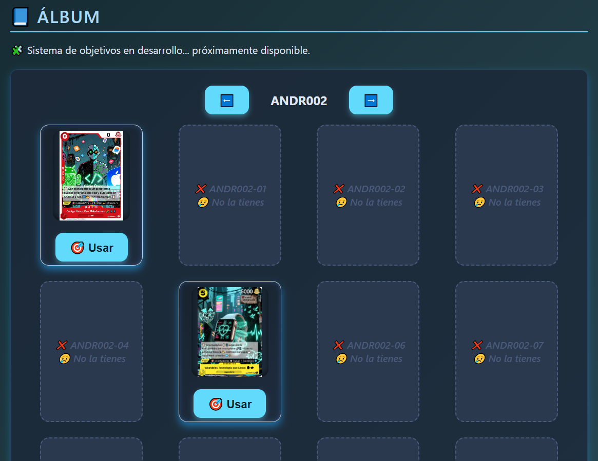

- Modal para ver carta ampliada.

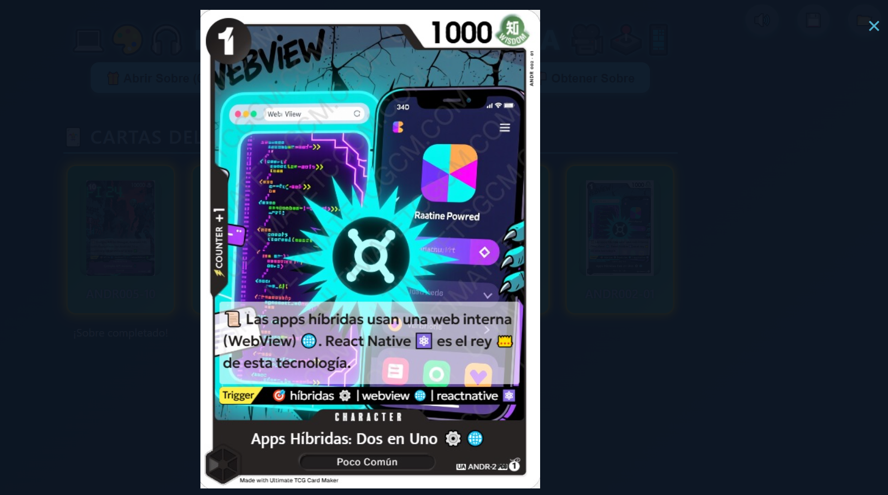

- Trivia con preguntas cargadas desde preguntas.json.

- Ruleta de premios tras completar desafíos.

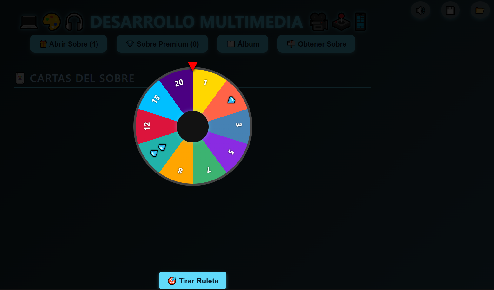

- Sonidos y música (música de fondo / música de trivia / efectos). La opción de desactivar y activar la música pulsando sobre el icono.

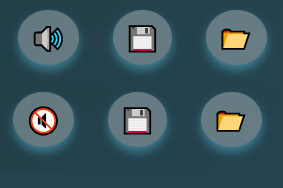

- Guardado y carga de progreso en localStorage.

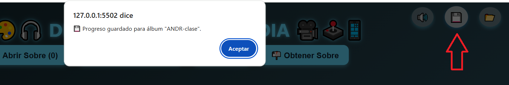

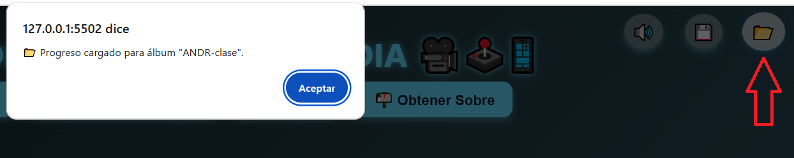

- Paginación del álbum y agrupado de 20 cartas por colecciones.

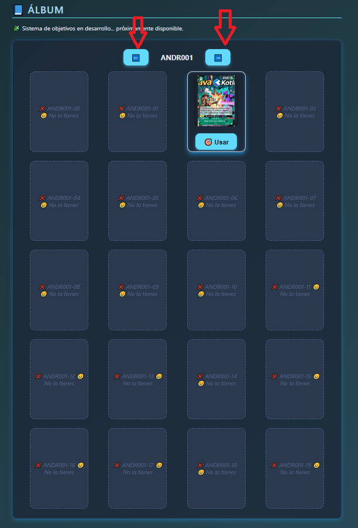

- Sistema de objetivos (actualmente desactivado / “en desarrollo” ya lo tengo completado, haciendole pruebas).Los objetivos basicamente consiste en encontrar la carta con la mismo triggers o descripción, darle a usar y si coinciden se premiara al usuario con una carta premium (tienen las misma probabilidad de que salgan las cartas del nivel 0 al nivel 19, las cartas normales tienes mayor probabilidad que salgan cartas del nivel 0 y mas dificil el nivel 19)

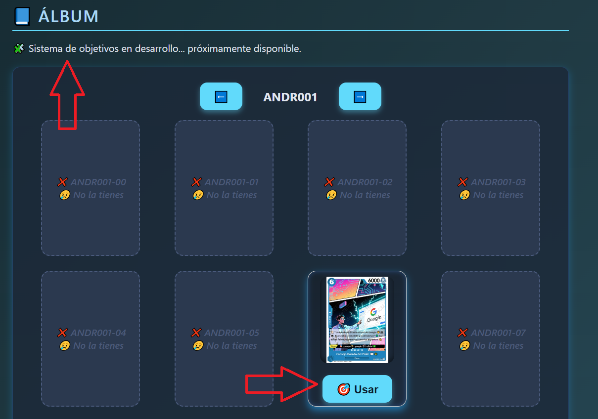

- Datos de cartas y preguntas almacenados en JSON (cards.json, preguntas.json).

En cards.json tenemos los datos de las cartas (tengo que agregar los text/trigger a todas las cartas en desarrollo)

En preguntas.json tengo todas las preguntas de mi trivial, donde tendra que el usuario acertar 3 veces seguidas para poder conseguir una tirada en la ruleta y conseguir sobres normales o premium

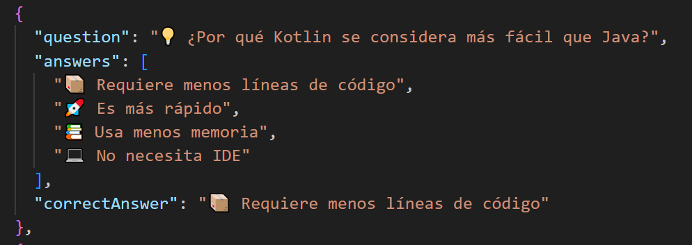

- Uso de técnicas de UX (animaciones CSS para cartas nuevas, transiciones, feedback visual). Por ejemplo la animación de movimiento de la ruleta al pulsar tirar, junto con sonido de la ruleta, ... el objetivo hacer atractivo la GUI.

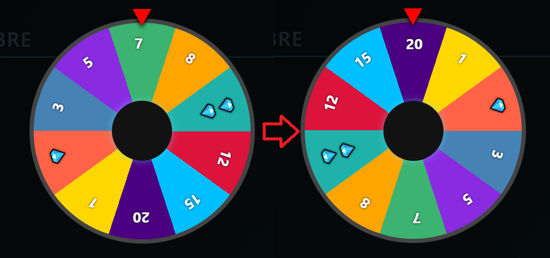

---

## Qué he aprendido en la asignatura y aplico en este proyecto

A lo largo de la asignatura y creando este proyecto he aprendido y puesto en práctica los siguientes conceptos:

> HTML

- Estructura semántica de una página (header, main, section).

- Uso correcto de atributos alt, title y lang.

- Creación de modales y componentes accesibles (gestión del cierre con click fuera y botón).

> CSS

- Diseño responsive con grid y flexbox para la rejilla de cartas y el layout general.

- Temas y gradientes, sombras y efectos visuales para mejorar la experiencia.

- Animaciones y keyframes para notificar cartas nuevas o pulso en premios.

- Técnicas para diseño móvil-first y media queries.

- Organización de estilos para mantener consistencia visual.

> JavaScript

- Manipulación del DOM (crear y actualizar elementos dinámicamente).

- Eventos (clicks, carga, delegación y gestión de listeners).

- fetch + async/await para cargar archivos JSON locales.

- Manejo del audio vía la API Audio (controlar volumen, loop, reproducción segura).

- Control de estado en la app (album, sobres disponibles, trivia, ruleta).

- Uso de localStorage para persistencia básica de partida.

- Buenas prácticas básicas: separación de responsabilidades (aunque no aún modularizada), manejo de errores y try/catch implícito en catch de promesas.

- Patrones de UX: desactivar botones, mostrar mensajes, prevenir acciones duplicadas.

> JSON

- Modelado de datos (cartas con id, name, image, group, rarity, text, triggers, etc.).

- Creación de colecciones y preguntas en formato JSON para consumir desde fetch.

> Bootstrap (conceptos)

- En la asignatura aprendí Bootstrap y utilicé los conceptos de diseño y utilidades (espaciados, tipografías y grid).

- En este proyecto actual he construido estilos propios para aprender más en profundidad el CSS, pero mis decisiones de diseño y de estructura están fundamentadas en lo aprendido con Bootstrap. En futuros pasos integraré utilidades o componentes de Bootstrap cuando el proyecto requiera prototipado rápido.

---

## Estado actual y decisiones de diseño / mejora técnica

> Soy consciente de que el proyecto necesita modularización para crecer: dividir el código en módulos (ES Modules), separar vistas, lógica y almacenamiento, y usar un sistema de empaquetado (Vite/webpack) cuando escale. Esto permitirá:

- Reutilizar código (p. ej. componentes de carta, modal, ruleta).

- Testear unidades individuales.

- Mantener más limpio el repositorio.

- Facilitar incorporación de frameworks o librerías si es necesario.

---

## Persistencia actual

> Actualmente guardo el progreso en localStorage (partidas y estado del álbum).

- Sé que esto no es una solución sostenible para un producto real (no es multiusuario, se pierde si se borran datos del navegador, no sincroniza entre dispositivos).

> Mi plan: aprender PHP y pasar a un backend que guarde en una base de datos relacional (MySQL/PostgreSQL). También estoy valorando Node/Express como alternativa, pero dado que en el grado/curso estudiaré PHP, quiero implementar la versión con PHP + BBDD para practicar lo visto en clase y asegurar compatibilidad con hosting tradicional.

---

## Plan servidor / dinámico

> Crear una API REST (en PHP inicialmente) que permita:

- Autenticación básica (usuarios).

- CRUD de cartas y paquetes (crear cartas a partir de mi material de estudio).

- Gestionar preguntas del trivial y su nivel de dificultad.

- Guardar progreso de usuario en la base de datos.

- Generar sobres dinamicamente según probabilidades / rarity pools.

> Con esto el proyecto ganará:

- Persistencia robusta (progreso, cuentas).

- Posibilidad de que los usuarios creen álbumes públicos/privados.

- Backend para generar contenido automáticamente a partir de material de estudio (subida de imágenes, texto y preguntas).

---

# Roadmap / ideas futuras (tengo mil ideas 😅)

- Modularizar JS: componentes, servicios (API), utilidades.

- Autenticación y gestión de usuarios.

- Back-end en PHP + BBDD para persistencia y generación dinámica de cartas.

- Editor de cartas para crear cartas desde el servidor (subir imágenes y preguntas).

- Más minijuegos vinculados al estudio (flashcards, memoria, arrastrar y soltar, retos cronometrados) que permitan ganar cartas.

- Sistemas de logros y niveles para gamificación.

- Intercambio/comercio entre usuarios (si la base de usuarios lo permite).

- Internacionalización (i18n) para soportar varios idiomas.

- Tests automatizados (unitarios y e2e).

- Mejor accesibilidad (a11y) y compatibilidad con screen-readers.

- Export / Import de álbumes y progreso (formato JSON) y backups.

---

## Cómo ejecutar el proyecto (entorno local)

> Para ver el proyecto correctamente debes servirlo por HTTP, no abrir index.html directamente desde el sistema de archivos en algunos navegadores por restricciones de fetch y CORS.

> Opciones recomendadas:

- Usando Visual Studio Code

- Instalar la extensión Live Server (Ritwick Dey).

- Abrir la carpeta del proyecto en VSCode.

- Hacer clic derecho en index.html → Open with Live Server.

- La app abrirá en http://127.0.0.1:5500/ (u otro puerto).

> Alternativa: servidor HTTP con Python (si tienes Python)

- Desde la carpeta del proyecto ejecuta:

- Python 3:

- python -m http.server 8000

- Y abre en el navegador http://localhost:8000.

---

## Notas técnicas relevantes

> Con este proyecto he consiguido adquirir practicas y conocimientos sobre:

- DOM dinámico: creación y destrucción de elementos (sobres, pack, album, ruleta).

- Persistencia local: localStorage para experiencia offline rápida.

- Manejo de audio: preload y control de reproducción segura (tratando play() con catch para evitar errores por autoplay).

- Paginación: manejo de currentPage y cardsPerPage para rendimiento.

- Generación de premios / probabilidades: lógica para rarezas y selección aleatoria (probabilidades ajustables).

- Separation of concerns (en proceso): intento de mantener funciones pequeñas y responsabilidades separadas, con intención clara de modularizar.

- UX / Animaciones: feedback inmediato al usuario (sonidos, cambios visuales y transiciones).

---

## Cómo contribuir / sugerir mejoras

> Si revisas este repositorio y quieres colaborar:

- Abre un issue con sugerencias (p. ej. "modularizar audio", "mover fetch de JSON a API").

- Pull requests: prefiero PRs pequeños y documentados (añadir tests o mejorar documentación).

- Comentarios sobre arquitectura y escalabilidad son bienvenidos — estoy aprendiendo buenas prácticas y agradezco el feedback de profesionales.

---

## Qué estoy buscando

- Practicar en frontend / fullstack donde pueda aplicar lo aprendido y continuar con la parte de backend (PHP + BBDD).

- Mentorización sobre cómo diseñar una API sólida y cómo migrar de localStorage a una solución con login y BBDD.

- Proyectos que me permitan trabajar con usuarios reales y levantar una pequeña comunidad de estudio/gamificación.

---

## Para terminar: un Mensaje final (personal)

> Estoy disfrutando muchísimo el proceso de pasar de conceptos teóricos a soluciones reales: construir una aplicación que me ayuda a repasar mis materias y al mismo tiempo aprender tecnologías web ha sido muy motivador.

> Soy consciente de que para que esto alcance su máximo potencial debo modularizar, aprender la parte de servidor (PHP y bases de datos) y mejorar la arquitectura — eso será mi foco en el siguiente curso. Mientras tanto, lo que veis es una base sólida con muchas ideas por implementar. 🚀
