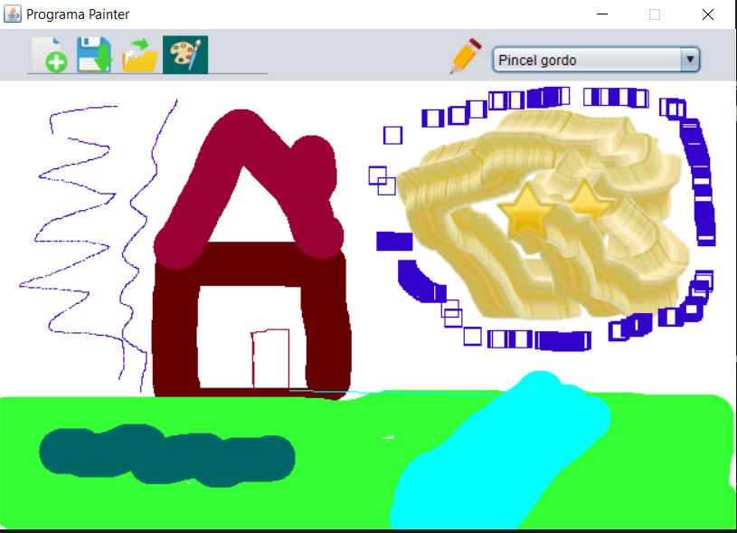
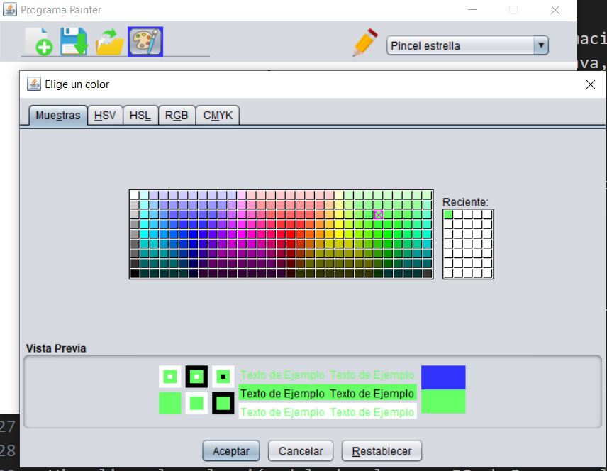
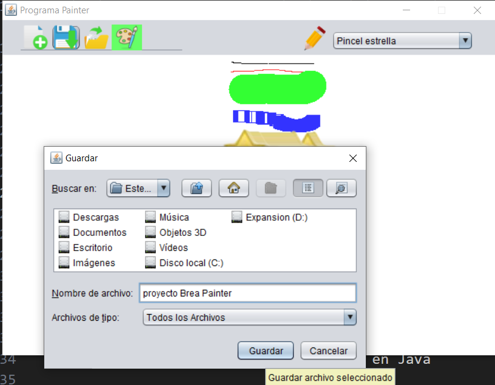
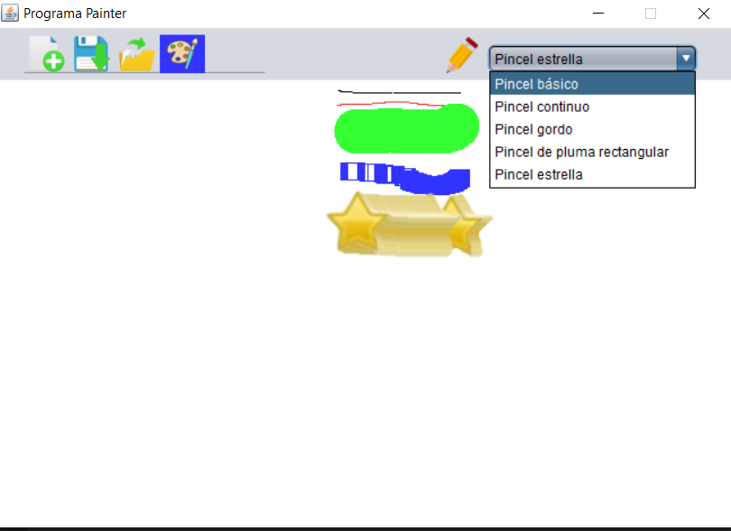
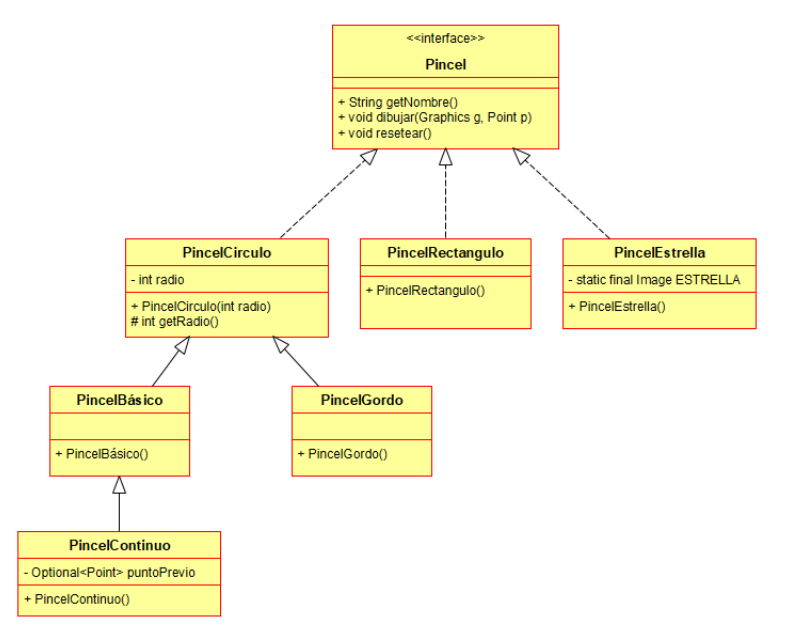

# Proyecto: Paint en Java 8

[↩️ Volver al inicio](../../README.md)

---

## Descripción del proyecto

> Este proyecto consiste en el desarrollo de una aplicación de dibujo sencilla, similar a Paint, realizada con Java 8 y el uso de Swing/AWT.

- **Haz click sobre la imagen para acceder al enunciado de la tarea**
  

> El objetivo principal es aplicar conceptos de Programación Orientada a Objetos (POO) y familiarizarnos con componentes gráficos en Java, como JFrame, JLabel, JButton, JComboBox, JToolBar y BufferedImage.

La aplicación permite:

- Dibujar sobre un área de dibujo utilizando diferentes tipos de pinceles (círculo, rectángulo, estrella, continuo, básico, gordo).

- Cambiar el color del pincel mediante un selector de color (JColorChooser).

- Abrir, guardar y crear nuevas imágenes en formato JPG.

- Visualizar la selección del pincel en un JComboBox con el nombre correcto.

---

## Objetivos de aprendizaje

Durante esta práctica, he aprendido y aplicado los siguientes conceptos:

- Programación Orientada a Objetos (POO) en Java

- Creación de interfaces (Pincel) y su implementación en múltiples clases (PincelCirculo, PincelRectangulo, PincelEstrella).

- Herencia y polimorfismo: Por ejemplo, PincelBasico hereda de PincelCirculo y PincelContinuo hereda de PincelBasico. Esto permite que los pinceles compartan métodos y atributos comunes mientras se especializan en su comportamiento.

- Uso de métodos abstractos e implementaciones concretas, aplicando la idea de “programar hacia la interfaz, no hacia la implementación”.

- Trabajar con AWT y Swing

- Uso de JFrame como ventana principal de la aplicación.

- Componentes gráficos: JLabel para el área de dibujo, JButton para acciones (Nuevo, Abrir, Guardar, Color), JComboBox para la selección de pinceles y JToolBar para agrupar botones.

- Uso de BufferedImage para manejar un lienzo sobre el que se dibuja y poder actualizar la pantalla en tiempo real con Graphics.

- Eventos y manejo de interacción del usuario

- Manejo de eventos de ratón (MouseDragged) para dibujar en el área de dibujo.

- Manejo de eventos de combobox (itemStateChanged) para cambiar de pincel y resetear su estado.

- Manejo de eventos de botones (ActionPerformed) para abrir el selector de color, guardar, abrir o crear una nueva imagen.

- Gestión de recursos y rutas de imágenes

- Uso de clases de utilidad de Java: JColorChooser para seleccionar colores de forma interactiva. JFileChooser para abrir y guardar archivos de imagen. ImageIO para leer y escribir imágenes en formato JPG.

---

## Funcionamiento del programa

Selección de pincel:

- El usuario puede seleccionar diferentes pinceles desde el JComboBox.

Cada pincel tiene un comportamiento distinto:

- Pincel básico: un punto de radio 1.

- Pincel continuo: conecta el punto anterior con el actual formando un trazo continuo.

- Pincel gordo: círculo relleno de radio 20.

- Pincel rectángulo: rectángulos huecos de tamaño 15x15.

- Pincel estrella: dibuja la imagen de una estrella centrada en el punto del ratón.

Cambio de color:

- El botón cmdColor abre un JColorChooser. Al seleccionar un color, el fondo del botón cambia al color elegido y los pinceles utilizan ese color al dibujar.

Área de dibujo (lblAreaDibujo):

- Es un JLabel que se utiliza como lienzo. Se inicializa con un fondo blanco, y sobre él se dibujan los pinceles usando un BufferedImage.

Guardar y abrir imágenes:

- El botón cmdGuardar abre un JFileChooser para elegir la ubicación y nombre del archivo, guardando el lienzo en formato JPG. El botón cmdAbrir permite cargar imágenes desde el disco y mostrarlas en el área de dibujo.

Nuevo lienzo:

- El botón cmdNuevo crea un lienzo en blanco, reiniciando el área de dibujo.

---

## Conclusión

Con esta práctica:

- He aprendido a combinar POO con interfaces gráficas en Java.

- He practicado manejo de imágenes, eventos y colores en Swing/AWT.

- He desarrollado un programa funcional que demuestra capacidad de estructurar un proyecto real usando buenas prácticas.

- Este proyecto no solo muestra cómo usar AWT y Swing, sino que también refuerza conceptos de diseño de software, reutilización de código y modularidad.
